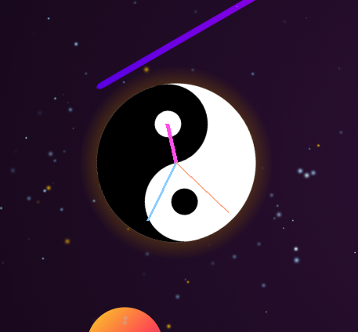
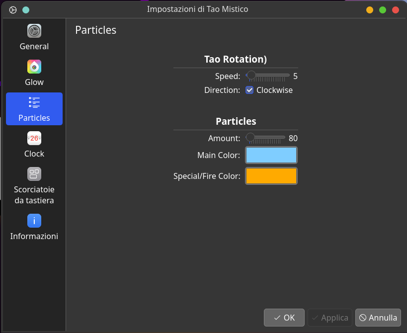

# Tao Widget for KDE Plasma 6

A meditative Yin Yang animation for your KDE Plasma 6 desktop. A slowly rotating Tao symbol surrounded by a reactive particle system — with an optional analog clock overlay.

<p align="center">
  
</p>

| Clock Mode | Configuration |
|:---:|:---:|
|  |  |

---

## Features

**Two render engines** — choose the one that fits your setup:
- **Zen (Native C++)** — a custom Qt Scene Graph renderer with a dedicated GPU pipeline, pre-built vertex buffers, and a multithreaded particle simulation running on a background thread via `QtConcurrent`. Zero CPU overhead on the render thread.
- **WebGL (Browser)** — an HTML5 Canvas + WebGL fallback that runs inside a `WebEngineView`. No native compilation required.

**Particle system**
- Up to 20 000 simultaneous particles (configurable)
- Physics simulation: friction, boundary bounce, Tao avoidance, mouse attraction
- Two independent particle color channels with speed-based color shift
- Particles respond to mouse position in real time

**Glow effects** — two independent radial glow layers, each with configurable color and radius

**Mystical Clock** — optional analog clock overlay with three independently colored hands (hour, minute, second) rendered directly on the Tao symbol

**HiDPI / Retina support** — both engines generate textures and canvas output at the physical device pixel ratio, sharp on 4K and Retina displays

**Highly configurable**
- Particle count, rotation speed, direction (clockwise / counter-clockwise)
- Individual colors for particles, glow layers, clock hands
- Background transparency toggle
- Engine selector (Zen Native / WebGL)

---

## Installation

### Quick install (pre-built)

Download the [latest release](https://github.com/postadelmaga/plasmoid-Tao/releases/latest/download/tao-widget.plasmoid) and run:

```bash
kpackagetool6 -t Plasma/Applet --install tao-widget.plasmoid
```

> **Note:** the pre-built `.plasmoid` includes a native plugin compiled on Arch Linux with `x86-64-v3` (AVX2, requires a CPU from 2013 or later). If it does not load on your system, build from source instead.

To reinstall after an update:

```bash
kpackagetool6 -t Plasma/Applet --remove  org.kde.plasma.taowidget
kpackagetool6 -t Plasma/Applet --install tao-widget.plasmoid
```

---

### Build from source

Building from source ensures the native plugin is optimized for your exact system and Qt/KDE version.

#### Dependencies

<details>
<summary><b>Arch Linux / Manjaro</b></summary>

```bash
sudo pacman -S cmake ninja extra-cmake-modules \
               qt6-base qt6-declarative qt6-tools \
               kf6-config kf6-coreaddons \
               plasma-framework qt6-shader-baker
```
</details>

<details>
<summary><b>Ubuntu 24.04 / KDE Neon</b></summary>

```bash
sudo apt install cmake ninja-build extra-cmake-modules \
                 qt6-base-dev qt6-declarative-dev qt6-tools-dev \
                 libkf6config-dev libkf6coreaddons-dev \
                 libplasma-dev qt6-shader-baker
```
</details>

<details>
<summary><b>Fedora</b></summary>

```bash
sudo dnf install cmake ninja-build extra-cmake-modules \
                 qt6-qtbase-devel qt6-qtdeclarative-devel qt6-qttools-devel \
                 kf6-kconfig-devel kf6-kcoreaddons-devel plasma-devel
```
</details>

#### Build and package

```bash
git clone https://github.com/postadelmaga/plasmoid-Tao.git
cd plasmoid-Tao
chmod +x build.sh
./build.sh
```

This compiles the shaders, builds the native C++ plugin with `-O3 -march=x86-64-v3 -ffast-math`, and packages everything into `tao-widget.plasmoid`.

Then install with:

```bash
kpackagetool6 -t Plasma/Applet --install tao-widget.plasmoid
```

---

## Project structure

```
plasmoid-Tao/
├── tao-widget/
│   ├── contents/
│   │   └── ui/
│   │       ├── main.qml               # Widget root
│   │       ├── configGeneral.qml      # Settings page
│   │       └── native/                # Native plugin (populated by build.sh)
│   │           ├── libtaoplugin.so
│   │           └── shaders/
│   │               ├── particle.vert.qsb
│   │               └── particle.frag.qsb
│   ├── src/
│   │   ├── TaoQGraphHybrid.cpp        # Qt Scene Graph particle engine
│   │   ├── TaoQGraphHybrid.h
│   │   ├── TaoPlugin.cpp              # QML plugin registration
│   │   └── shaders/                   # GLSL shader sources
│   │       ├── particle.vert
│   │       └── particle.frag
│   ├── CMakeLists.txt
│   └── metadata.json
├── build.sh                           # Build + package script
└── install.sh                         # System-wide install script
```

---

## Technical notes

The native Zen engine uses a fully custom Qt Scene Graph pipeline:

- **Interleaved vertex buffer** — position, UV, color packed in a single 20-byte stride, uploaded to the GPU with a single `bufferData` call per frame
- **Pre-built quads** — particle quads are assembled on the worker thread and `memcpy`'d directly into the vertex buffer on the render thread, keeping the GPU thread as lean as possible
- **Multithreaded simulation** — physics runs on a `QtConcurrent` worker thread; the render thread only copies results and submits draw calls
- **HiDPI textures** — the Tao symbol and glow textures are generated at `size × devicePixelRatio` physical pixels with `QPainter`, crisp at any display density

---

## Credits

Developed with ❤️ for the KDE community.  
AI-assisted development using Claude (Anthropic) and Gemini (Google).
