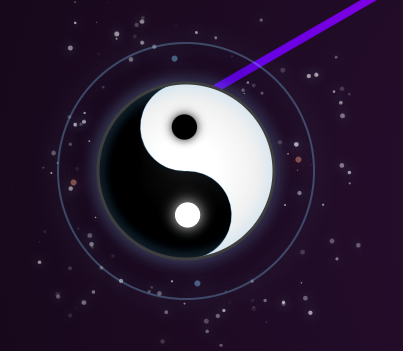
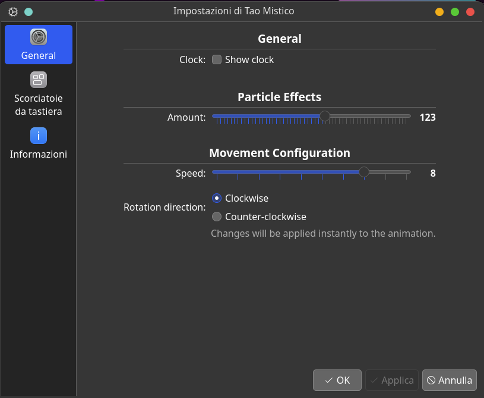

# Tao Widget 

A beautiful and meditative Yin Yang (Tao) animation for your KDE Plasma 6 desktop. This widget combines ancient symbolism with modern aesthetics, featuring a dynamic particle system and an optional mystical clock.

### Preview

### Clock Mode & Configuration
| Clock Enabled | Configuration Menu |
|:---:|:---:|
|  |  |

## Features

- **Zen Animation**: A slowly rotating Tao symbol that brings peace to your workspace.
- **Dynamic Particles**: A custom particle system that reacts to the central symbol.
- **Mystical Clock**: An optional overlay that transforms the widget into a functional clock with neon-lit hands.
- **Highly Customizable**:
  - Adjust particle count and density.
  - Control rotation speed and direction (clockwise or counter-clockwise).
  - Toggle the clock display on/off.
- **Modern Performance**: Optimized HTML5 Canvas engine running inside a native QML frame with blur effects.

## Installation

Download [last release](https://github.com/postadelmaga/plasmoid-Tao/releases/latest/download/tao-widget.plasmoid) and run `kpackagetool6 -t Plasma/Applet -i tao-widget.plasmoid`

## Credits
Developed with 🤖 Antigravity by Gemini. This project was implemented entirely using agentic AI technology to ensure high-quality code and modern design standards
Created with passion for the KDE community.